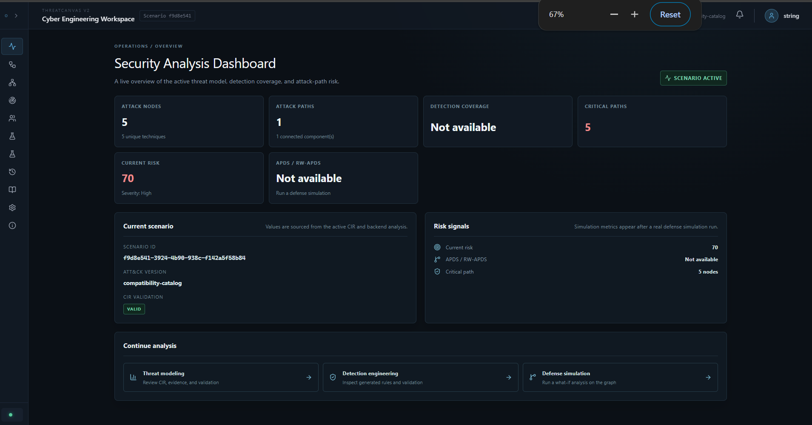
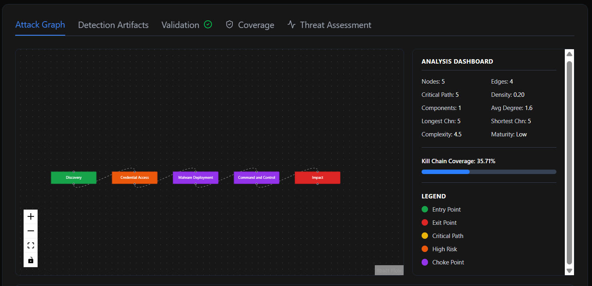
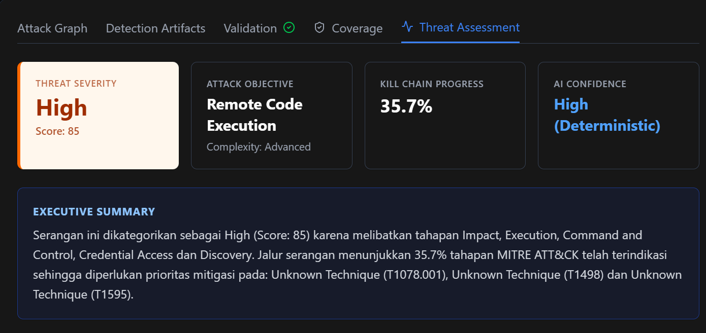

<div align="center">

# 🛡️ ThreatCanvas

**AI-Powered Threat Narrative to Detection Engineering Platform**

Transform natural language attack scenarios into structured, deterministic attack graphs — validate them, analyze their MITRE ATT&CK coverage, reason about their threat impact, and compile production-ready detection rules across multiple SIEM formats.

[](https://fastapi.tiangolo.com/)
[](https://react.dev/)
[](https://www.typescriptlang.org/)
[](https://www.sqlalchemy.org/)
[](#license)

</div>

---

## 📖 Overview

**ThreatCanvas** is an AI-assisted cyber engineering workspace that bridges the gap between *threat intelligence narratives* and *machine-readable detection artifacts*. Analysts describe an attack scenario in plain English — ThreatCanvas parses it into a **CIR (Cyber Intermediate Representation)** graph, deterministically validates it, analyzes its structure and MITRE ATT&CK coverage, reasons about its threat objective and severity, and compiles it into ready-to-deploy detection rules for **Sigma**, **KQL**, and **SPL**.

Unlike a SIEM, EDR, or IDS, ThreatCanvas doesn't monitor live traffic — it's a **detection engineering accelerator**: a structured pipeline for turning threat research and incident narratives into testable, deployable detection logic, with full traceability back to the original scenario.

---

## 📸 Preview

> Screenshots below are placeholders — drop your own images into `docs/images/` with these filenames and they'll render automatically on GitHub.

### Dashboard — Threat Narrative Processor


### Attack Graph Visualization


### Coverage & Threat Assessment


<div align="center">

**Narrative → Generate → Attack Graph → Coverage → Threat Assessment**
*(from raw text to actionable detection engineering output, in one workspace)*

</div>

---

## 🔄 How It Works

```
Natural Language Narrative
            │
            ▼
   Intelligent CIR Engine        ← LLM-based parsing into structured graph
            │
            ▼
   CIR Validation Engine         ← deterministic structural integrity checks
            │
            ▼
   Detection Compiler            ← Sigma · KQL · SPL rule generation
            │
            ▼
   MITRE Coverage Analysis       ← kill chain & tactic/technique scoring
            │
            ▼
   Attack Graph Analysis         ← critical path, density, complexity, maturity
            │
            ▼
   Threat Reasoning Engine       ← severity, objective, detection gaps, priority
```

---

## 🔬 Research Contributions

ThreatCanvas introduces several engineering contributions at the intersection of LLMs and structured security data modeling:

- **Natural Language → Deterministic Cyber Intermediate Representation (CIR)** — a structured, schema-validated intermediate graph format that constrains LLM output into consistent, machine-actionable attack representations.
- **Deterministic CIR Validation Engine** — rule-based structural validation that catches malformed or logically inconsistent attack graphs before they propagate downstream.
- **Multi-Platform Detection Rule Compiler** — a single CIR graph compiles into multiple SIEM-native detection formats (Sigma, KQL, SPL) without re-parsing the original narrative.
- **MITRE ATT&CK Coverage Analysis** — automated scoring of kill chain completeness, tactic/technique coverage, and gap identification against the ATT&CK framework.
- **Attack Graph Analysis** — deterministic graph-theoretic metrics (critical path, density, complexity, maturity) computed directly from the CIR structure.
- **Threat Reasoning & Recommendation Engine** — rule-based reasoning layer that derives threat severity, attacker objective, and detection recommendations from graph and coverage output.

*(This section is intentionally structured to map cleanly onto a paper's contribution list — extend with citations as work is published.)*

---

## ✨ Feature List

- **🧠 Natural Language → Attack Graph** — Describe an attack scenario conversationally; the LLM parser converts it into a structured CIR graph of tactics, techniques, actors, and relationships.
- **✅ Deterministic Validation** — Every generated graph is validated for structural integrity before any detection artifact is compiled, reducing hallucinated or inconsistent attack logic.
- **📈 Attack Graph Analysis** — Deterministic graph metrics including critical path, node/edge density, component count, average degree, complexity score, and overall graph maturity rating.
- **🧠 Threat Assessment** — Rule-based threat reasoning that derives severity, likely attack objective, detection gaps, and prioritized recommendations from the analyzed graph.
- **🎯 MITRE ATT&CK Coverage Scoring** — Automatic analysis of kill chain coverage, tactic/technique completeness, and actionable recommendations for gaps.
- **⚙️ Multi-Format Detection Compilation** — One CIR graph compiles into **Sigma**, **KQL** (Microsoft Sentinel/Defender), and **SPL** (Splunk) rules simultaneously.
- **📚 Prompt Library** — A curated collection of 20+ real-world attack scenario templates across Ransomware, APT Campaigns, Insider Threat, Cloud Security, Phishing, Web Application, Supply Chain, and IoT/OT categories.
- **🔔 Real-Time Activity Notifications** — Every meaningful action (parsing complete, artifact generated, coverage analyzed) surfaces as a live, event-driven notification in the UI.
- **🔐 JWT Authentication** — Secure token-based auth with bcrypt password hashing, protecting the workspace and ready to extend to multi-user/role-based access.
- **🕘 Scenario History** — Every processed scenario and its generated CIR graph is persisted and retrievable for later review or re-compilation.

---

## 🏗️ Architecture

```
                            ┌───────────────┐
                            │   LLM Parser   │
                            └───────┬───────┘
                                    │
                                    ▼
                         ┌────────────────────┐
                         │  CIR Validation     │
                         └──────────┬──────────┘
                                    │
              ┌─────────────────────┼─────────────────────┐
              ▼                     ▼                     ▼
     ┌─────────────────┐  ┌──────────────────┐  ┌──────────────────┐
     │ Detection        │  │ Coverage Engine   │  │ Graph Analysis    │
     │ Compiler          │  │ (MITRE ATT&CK)    │  │ (metrics)         │
     │ Sigma·KQL·SPL     │  │                    │  │                   │
     └─────────┬─────────┘  └─────────┬─────────┘  └─────────┬─────────┘
               │                      │                       │
               └──────────────────────┴───────────────────────┘
                                       │
                                       ▼
                         ┌─────────────────────────┐
                         │  Threat Reasoning Engine │
                         └─────────────────────────┘
```

```
┌─────────────────────────────────────────────────────────────────┐
│                        FRONTEND (React + Vite)                   │
│  Dashboard · History · Prompt Library · Settings                 │
│  Zustand Stores: useThreatStore · useAuthStore · useNotification  │
└───────────────────────────┬───────────────────────────────────────┘
                             │ REST API (JWT Bearer)
┌───────────────────────────▼───────────────────────────────────────┐
│                       BACKEND (FastAPI)                            │
│   Auth (JWT) · LLM Parser · CIR Validator/Normalizer               │
│   Coverage Analyzer · Graph Analysis Engine · Threat Reasoning      │
│   Compilers: Sigma · KQL · SPL                                      │
│   Repository Layer (SQLAlchemy) ── SQLite / PostgreSQL             │
└─────────────────────────────────────────────────────────────────┘
```

---

## 🧪 Example

**Input** (typed directly into the Dashboard, or loaded from the Prompt Library):

```text
An attacker sends a phishing email with a malicious PowerShell script and
simultaneously performs credential dumping to harvest high-privilege domain
hashes. Following this, the attacker establishes persistence using scheduled
tasks, disables Windows Defender endpoint protection, conducts internal
network discovery, moves laterally across servers using PsExec, and finally
deploys ransomware to completely encrypt all core enterprise databases and
systems.
```

**Generated output**, in order:

1. **CIR Graph** — 8 nodes, 8 edges spanning Initial Access → Credential Access → Persistence → Defense Evasion → Discovery → Lateral Movement → Impact
2. **MITRE Coverage Report** — kill chain coverage %, covered/missing tactics, complexity and maturity rating
3. **Attack Graph Metrics** — critical path length, graph density, average degree, component count
4. **Detection Artifacts** — matching Sigma, KQL, and SPL rules, one per node/technique
5. **Threat Assessment** — derived severity, primary attack objective (e.g. *data destruction via ransomware*), and prioritized detection recommendations

---

## 🧰 Tech Stack

| Layer | Technology |
|---|---|
| **Backend Framework** | FastAPI, Uvicorn |
| **ORM / Database** | SQLAlchemy 2.0, SQLite (dev) / PostgreSQL (prod-ready via `psycopg`) |
| **Auth** | JWT (`python-jose`), bcrypt password hashing (`passlib`) |
| **Schema Validation** | Pydantic v2 |
| **Task Queue** | Celery + Redis (for async/long-running processing) |
| **LLM Integration** | OpenAI-compatible API client |
| **Frontend Framework** | React 18, TypeScript, Vite |
| **State Management** | Zustand |
| **Routing** | React Router v6 |
| **Styling** | Tailwind CSS |
| **Icons** | Lucide React |

---

## 📁 Project Structure

```
ThreatCanvas/
├── backend/
│   ├── app/
│   │   ├── api/
│   │   │   ├── deps.py                # Auth dependency injection
│   │   │   └── endpoints/              # parser, compilers, coverage,
│   │   │                                # graph_analysis, reasoning, auth
│   │   ├── core/
│   │   │   ├── config.py               # Environment-based settings
│   │   │   ├── database.py             # SQLAlchemy engine/session
│   │   │   └── security.py             # JWT + password hashing
│   │   ├── models/                     # SQLAlchemy ORM entities
│   │   ├── repositories/               # Data access layer
│   │   ├── schemas/                    # Pydantic request/response models
│   │   ├── services/                   # LLM parser, compilers, analyzers
│   │   └── main.py                     # FastAPI app entrypoint
│   └── tests/
│
└── frontend/
    └── src/
        ├── components/
        │   ├── layout/                 # Header, Sidebar, MainLayout
        │   ├── ArtifactViewer.tsx
        │   ├── ThreatGraph.tsx
        │   ├── Coverage.tsx
        │   └── RichCIRInspector.tsx
        ├── pages/                      # Dashboard, History, PromptLibrary,
        │                                # Settings, Login
        ├── store/                      # Zustand stores (threat, auth, notifications)
        └── App.tsx                     # Routing entrypoint
```

---

## 🚀 Getting Started

### Prerequisites

- Python 3.13+
- Node.js 18+
- (Optional) Redis, for Celery task queue features

### Backend Setup

```bash
cd backend
python -m venv venv
source venv/bin/activate        # Windows: venv\Scripts\activate

pip install -r requirements.txt

# Create your .env file
cp .env.example .env
# Generate a secret key for JWT signing:
python -c "import secrets; print(secrets.token_urlsafe(32))"
# Paste the output into SECRET_KEY in .env

uvicorn app.main:app --reload --port 8000
```

The API will be available at `http://localhost:8000`, with interactive docs at `http://localhost:8000/docs`.

### Frontend Setup

```bash
cd frontend
npm install
npm run dev
```

The app will be available at `http://localhost:5173`.

### Create Your First User

```bash
curl -X POST http://localhost:8000/api/v1/auth/register \
  -H "Content-Type: application/json" \
  -d '{"username":"analyst","email":"analyst@threatcanvas.local","full_name":"Security Analyst","password":"a-strong-password"}'
```

Then log in through the frontend at `http://localhost:5173/login`.

---

## 🔑 Environment Variables

| Variable | Description | Default |
|---|---|---|
| `DATABASE_URL` | SQLAlchemy connection string | `sqlite:///./threatcanvas.db` |
| `SECRET_KEY` | JWT signing secret — **must be overridden in production** | — |
| `ALGORITHM` | JWT signing algorithm | `HS256` |
| `ACCESS_TOKEN_EXPIRE_MINUTES` | Token lifetime | `1440` (24h) |
| `OPENAI_API_KEY` | LLM provider API key | — |
| `OPENAI_API_BASE` | LLM provider base URL | — |
| `REDIS_URL` | Redis connection for Celery | `redis://localhost:6379/0` |

---

## 📡 API Reference

All endpoints are prefixed with `/api/v1`. Full interactive documentation (with live request/response schemas) is available via Swagger UI at `/docs` once the backend is running — treat that as the source of truth over this table.

| Method | Endpoint | Description |
|---|---|---|
| `POST` | `/auth/register` | Register a new user |
| `POST` | `/auth/login` | Authenticate and receive a JWT (OAuth2 form body) |
| `POST` | `/parse` | Parse a natural language scenario into a CIR graph |
| `GET` | `/coverage/{scenario_id}` | Get MITRE ATT&CK coverage report |
| `GET` | `/compile/{type}/{scenario_id}` | Compile detection artifact (`sigma` \| `kql` \| `spl`) |
| `GET`/`POST` | `/graph-analysis/...` ⚠️ | Attack graph metrics (critical path, density, complexity) — verify exact route in `graph_analysis.py` |
| `GET`/`POST` | `/reasoning/...` ⚠️ | Threat reasoning & recommendations — verify exact route in `reasoning.py` |

> ⚠️ Routes marked above exist as registered routers (`graph_analysis.py`, `reasoning.py`) but their exact path signatures weren't confirmed while writing this doc — check `/docs` for the authoritative path and payload shape before relying on them externally.

**Not yet backend-backed** (currently frontend-only, for transparency):
- **Notifications** — generated client-side in `useNotificationStore`, triggered by frontend actions. No `/notifications` endpoint exists yet.
- **Prompt Library** — currently a hardcoded `PROMPT_DATABASE` array in the frontend. No `/prompt-library` endpoint exists yet; a natural next step is moving this to a backend-managed table.

---

## 🗺️ Roadmap

- [ ] Role-based access control (multi-user, multi-role)
- [ ] Persist prompt library templates to the database
- [ ] Backend endpoint for notification history/audit trail
- [ ] Export coverage & threat assessment reports as PDF
- [ ] Additional compiler targets (YARA-L, EQL)
- [ ] Automated regression testing for CIR normalization edge cases

---

## 📄 License

This project is licensed under the MIT License.

---

<div align="center">

Built for security researchers and detection engineers who think in graphs, not just logs.

</div>
