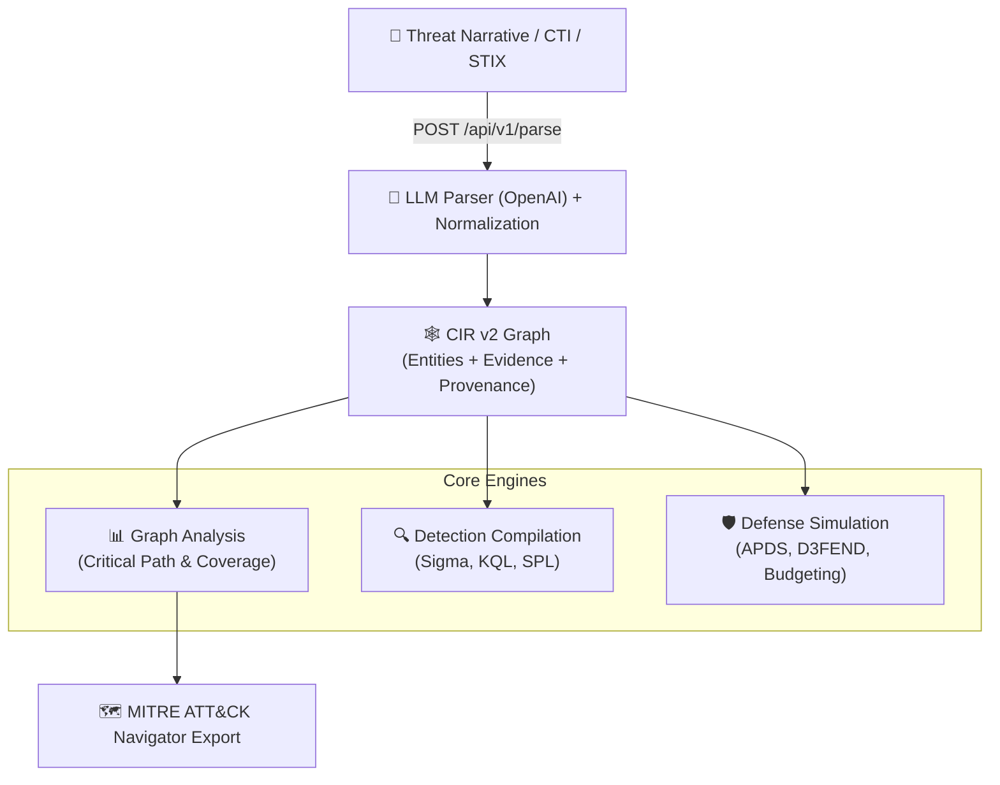

# 🛡️ ThreatCanvas

**ThreatCanvas** is an AI-assisted cyber engineering workspace for turning natural-language attack narratives and CTI packages into structured CIR graphs, ATT&CK-aware analysis, detection artifacts, collective-defense insights, and measurable defense simulations.

Built with a clear separation of concerns:
- **Threat Modeling & Attack Graph**: Maps the ordered attack path for the active scenario.
- **Knowledge Graph**: Explores CIR entities, provenance, evidence, and typed relationships.
- **Threat Intelligence**: Imports STIX and normalizes TAXII/MISP/OpenCTI-style payloads.
- **Collective Defense**: Correlates sanitized packages into shared techniques, coverage gaps, and a collective threat graph.
- **Simulation**: Measures how blocked techniques disrupt attack paths using APDS, RW-APDS, D3FEND-aligned recommendations, and budget optimization.

---

## 🌟 Key Features

- **🧠 AI-Powered Narrative Parsing**: Convert raw natural-language scenarios into structured CIR v2 graphs automatically.
- **💬 AI Scenario Copilot (NEW)**: Interactive chat interface to ask questions about the generated threat scenario, request mitigation strategies, and explore the graph conceptually.
- **🗺️ Interactive Threat Topologies**: Attack graph visualization with search, relationship filtering, critical path, high-risk nodes, blast radius, and graph metrics.
- **🛡️ D3FEND Remediation Copilot (NEW)**: Automatically maps extracted ATT&CK techniques to D3FEND countermeasures, providing a tailored active defense plan with rationales and confidence scores.
- **📄 Executive Report Generator (NEW)**: Instantly generate a comprehensive markdown report covering the threat narrative, graph summary, and critical path risk assessment.
- **🛡️ ATT&CK Navigator Export (NEW)**: Export your threat scenarios directly into a JSON layer compatible with the official MITRE ATT&CK Navigator.
- **🔍 Detection Engineering (Sigma/KQL/SPL)**: Generate and validate detection artifacts (syntax, schema, telemetry mapping, precision, recall, and F1).
- **💸 Budget-Aware Defense Simulation**: Run APDS/RW-APDS simulations to optimize defense controls based on a constrained security budget.
- **📊 Executive Assessment**: Critical path explainer, missing detection details, asset-aware risk signals, trust-zone grouping, and most-likely path probability.
- **⏱️ Attack Time Machine**: Replay ordered scenario steps visually.
- **🌐 CTI & STIX 2.1**: Import/Export STIX bundles, generic JSON connector for TAXII/MISP/OpenCTI.
- **🔒 Enterprise Ready**: JWT authentication, SSRF protection on CTI connectors, and controlled registration.

---

## 🏗️ Architecture


```mermaid
flowchart TD
    Narrative["📝 Threat Narrative / CTI / STIX"] -->|POST /api/v1/parse| LLM["🤖 LLM Parser (OpenAI) + Normalization"]
    LLM --> CIR["🕸️ CIR v2 Graph\n(Entities + Evidence + Provenance)"]
    
    CIR --> Analysis
    CIR --> Detection
    CIR --> Simulation
    
    subgraph Core Engines
        Analysis["📊 Graph Analysis\n(Critical Path & Coverage)"]
        Detection["🔍 Detection Compilation\n(Sigma, KQL, SPL)"]
        Simulation["🛡️ Defense Simulation\n(APDS, D3FEND, Budgeting)"]
    end
    
    Analysis --> Export["🗺️ MITRE ATT&CK Navigator Export"]
```

**Tech Stack**:
- **Frontend**: React 19 + TypeScript + Vite + TailwindCSS + Zustand
- **Backend**: FastAPI + Pydantic v2 + SQLAlchemy + SQLite/PostgreSQL

---

## 🚀 Quick Start

### 1. Backend Setup
```bash
cd backend
python -m venv .venv
# Activate environment
source .venv/bin/activate  # Linux/macOS
.venv\Scripts\Activate.ps1 # Windows

# Install dependencies
python -m pip install -r requirements.txt

# Configure environment
cp .env.example .env
```
> **Security Note**: You MUST set a secure `SECRET_KEY` in `.env`. The backend will refuse to start in production with an insecure default key.
> Generate one via: `python -c "import secrets; print(secrets.token_urlsafe(32))"`

Start the API:
```bash
uvicorn app.main:app --reload --port 8000
```

### 2. Frontend Setup
```bash
cd frontend
npm install
npm run dev
```
Access the dashboard at `http://localhost:5173`.

### 3. First User Creation
Registration is controlled via the `ALLOW_REGISTRATION` flag in the backend config. By default it is enabled for initial setup. Create your Lead Architect account:
```bash
curl -X POST http://localhost:8000/api/v1/auth/register \
  -H "Content-Type: application/json" \
  -d '{"username":"analyst","email":"analyst@threatcanvas.local","full_name":"Security Analyst","password":"a-strong-password"}'
```

---

## 🔧 Environment Variables

| Variable | Purpose | Default |
|---|---|---|
| `PROJECT_NAME` | Application name | `ThreatCanvas AI` |
| `ENVIRONMENT` | Runtime environment label | `development` |
| `OPENAI_API_KEY` | LLM provider API key | *empty* |
| `OPENAI_API_BASE` | OpenAI-compatible API base URL | `https://ai.sumopod.com/v1` |
| `DATABASE_URL` | SQLAlchemy database URL | `sqlite:///./threatcanvas.db` |
| `SECRET_KEY` | JWT signing secret | *must be replaced* |
| `ALLOW_REGISTRATION`| Toggle open registration for the `/register` endpoint | `true` |
| `ATTACK_STIX_PATH` | Optional local ATT&CK STIX bundle path | Auto-detects local JSON |
| `CTI_ALLOW_PRIVATE_NETWORKS` | Allow `/cti/fetch` to target RFC1918 private IPs | `false` |

---

## 📡 API Reference

All functional endpoints require `Authorization: Bearer <token>` (obtained from `/api/v1/auth/login`).

| Method | Endpoint | Description |
|---|---|---|
| `POST` | `/api/v1/auth/register` | Register a user (controlled via ALLOW_REGISTRATION) |
| `POST` | `/api/v1/parse` | Parse a narrative into CIR v2 |
| `GET` | `/api/v1/scenarios` | List saved scenarios |
| `GET` | `/api/v1/graph-analysis/{scenario_id}` | Graph metrics, critical path, asset risk |
| `GET` | `/api/v1/compile/{type}/{scenario_id}` | Compile `sigma`, `kql`, or `spl` rules |
| `POST` | `/api/v1/chat/{scenario_id}` | Ask questions to the AI Copilot about the scenario |
| `GET` | `/api/v1/d3fend/{scenario_id}` | View mapped D3FEND defensive countermeasures |
| `POST` | `/api/v1/{scenario_id}` | Run APDS/RW-APDS simulation & defense optimization |
| `GET` | `/api/v1/export/report/markdown/{scenario_id}`| Export an Executive Summary Report in Markdown |
| `GET` | `/api/v1/export/navigator/{scenario_id}`| Export scenario to MITRE ATT&CK Navigator JSON layer |
| `POST` | `/api/v1/cti/fetch` | Normalize STIX/TAXII/MISP/OpenCTI-style JSON payloads |

*(For full API documentation, visit `http://localhost:8000/docs` while the backend is running).*

---

## 🧪 Testing & Validation

**Backend**:
```bash
cd backend
$env:ENVIRONMENT="test"
pytest
```

**Frontend**:
```bash
cd frontend
npm run lint
npm run test
npm run build
```

**Benchmark**:
The repository includes a deterministic benchmark evaluator for validating CIR parsing precision and recall.
```bash
python -m benchmark.evaluation.report --cir-dir benchmark/results
```

---

## 📜 License

[MIT License](LICENSE)
